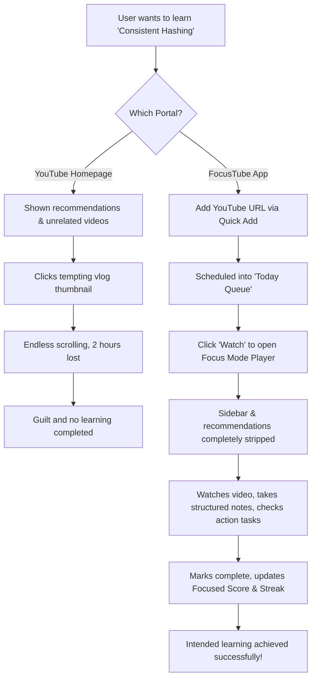
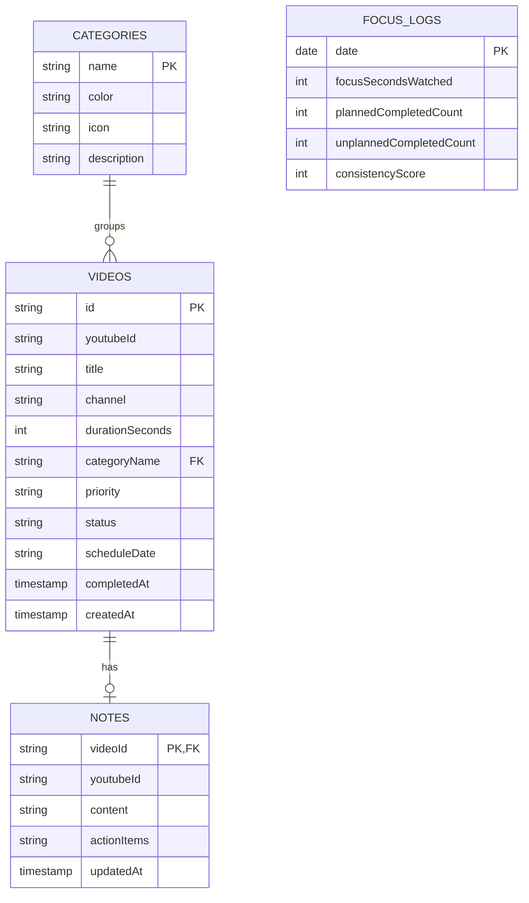

# FocusTube Design & Engineering Deliverables

This document consolidates the 14 specifications and assets required for the handoff, implementation, and launch of FocusTube.

---

## 1. User Personas

### Persona A: "Sarah the Upskilling Software Engineer"
*   **Demographics**: 28 years old, Female, SF Bay Area, Mid-level Frontend Engineer.
*   **Goals**: Wants to learn Kubernetes, System Design, and Rust to prepare for Senior Engineer promotions.
*   **Frustrations**: Starts watching a 20-minute System Design tutorial but gets pulled into tech drama channels, vloggers, or coding challenge streams in the sidebar. Ends up wasting 2 hours without coding.
*   **FocusTube Value**: Uses the "High Priority" queue to schedule exactly one Rust video on Monday, one Kubernetes video on Wednesday, and watches them in Focus Mode with direct note-taking.

### Persona B: "Marcus the University Student"
*   **Demographics**: 20 years old, Male, Chicago, Sophomore Computer Science student.
*   **Goals**: Prepare for tech internships and pass hard midterm modules.
*   **Frustrations**: Uses YouTube for homework walkthroughs but has extreme difficulty fighting autoplay recommendations. Finds his watch queues disorganized and bookmarks scattered across multiple browsers.
*   **FocusTube Value**: Builds a custom "LeetCode & Algorithms" category, links videos to a 3-week Learning Path, and monitors his weekly focused watch time.

---

## 2. User Journeys

Below is the user path comparing standard YouTube consumption to the FocusTube experience:



---

## 3. Information Architecture

FocusTube operates as a single-page workspace where layout items translate into modular views. The structure is organized as follows:

```
FocusTube Workspace (Global Context)
 ├── Global Navigation (Sidebar / Bottom Nav on Mobile)
 ├── Global Search & Command Palette (⌘K Trigger)
 ├── Active Work Area (Dynamic Views)
 │    ├── Dashboard View (Today's queue, quick metrics, quick video adder)
 │    ├── Watch Queue View (Priorities layout, Weekly schedule calendar)
 │    ├── Categories View (Focus subjects management cards)
 │    ├── Learning Paths View (Structured study roadmaps & milestones)
 │    ├── Analytics View (Streak counters, weekly watch time bar chart, distribution graph)
 │    └── Settings View (API keys, Google OAuth status, simulation database resets)
 └── Focus Mode Overlay (Full screen viewport)
      ├── Embedded Minimalist YouTube Player (Iframe)
      └── Markdown Notes Workspace (Auto-saving, format tools, checkbox checklist)
```

---

## 4. Sitemap

The sitemap maps out the layout, screens, navigation nodes, and actions:

```
[Main Entry Point]
 └── / (Default View: Dashboard)
      ├── Navigation Items:
      │    ├── Dashboard (Default) -> Today's Video cards + Quick Add URL
      │    ├── Watch Queue -> Grid of Priority lists (High/Medium/Low) + Weekly columns
      │    ├── Categories -> Subject Grid (custom colors & icons) + New Category form
      │    ├── Learning Paths -> Selected roadmap curriculum + Week columns + Milestones
      │    ├── Analytics -> Focus time bar charts + Category distribution graphs
      │    └── Settings -> Google Credentials + Database danger triggers
      ├── Global Elements:
      │    ├── Command search palette overlay (⌘K)
      │    ├── Theme Toggle (Light / Dark mode selector)
      │    └── Google Connection sync indicator
      └── Subviews:
           └── Focus Player overlay
                ├── Video embed viewport
                ├── Markdown Text Area (supports bold/italic/code/list syntax)
                ├── Checklist adder & action list
                └── "Mark Completed" success trigger
```

---

## 5. Wireframes

### View A: Dashboard Layout (Desktop)
```
+-----------------------------------------------------------------------------+
| FOCUS TUBE             [ Search here... (⌘K) ]   (Sync)  (Dark/Light Toggle)|
+-----------------------------------------------------------------------------+
| (D) Dashboard    |  [ Focus Score: 85/100 ] [ Streak: 5 Days ] [ Watch: 3h ]|
| (Q) Watch Queue  |                                                          |
| (C) Categories   |  TODAY'S QUEUE                   QUICK ADD VIDEO         |
| (L) Learn Paths  |  +-----------------------------+ +---------------------+ |
| (A) Analytics    |  | [Img] Title of Video   [Watch]| | YouTube URL:        | |
| (S) Settings     |  |       Category | High       | | [                     ] | |
|                  |  +-----------------------------+ | Category: [Prog  ] v  | |
|                  |  | [Img] Advanced RAG     [Watch]| | Priority: [Med   ] v  | |
|                  |  |       Category | Med        | | [   Add to Queue    ] | |
|                  |  +-----------------------------+ +---------------------+ |
+-----------------------------------------------------------------------------+
```

### View B: Focus Mode Player Layout
```
+-----------------------------------------------------------------------------+
| <- Back to Dashboard             Focus Mode Active              [✓ Synced]  |
+-----------------------------------------------------------------------------+
|                                             |  ACTIVE NOTES                 |
|  +---------------------------------------+  |  [ B ] [ I ] [ Code ] [List]  |
|  |                                       |  |  ---------------------------  |
|  |                                       |  |  Type markdown notes here...  |
|  |           EMBEDDED PLAYER             |  |                               |
|  |                                       |  |                               |
|  |                                       |  |                               |
|  |                                       |  |  ---------------------------  |
|  +---------------------------------------+  |  ACTION ITEMS                 |
|  Title of Video                             |  [ ] Implement Two Sum        |
|  Channel name                               |  [ ] Write replication docs   |
|  [ Mark Completed ]                         |  [ + Add action item        ] |
+-----------------------------------------------------------------------------+
```

---

## 6. High-Fidelity UI Mockups

FocusTube matches the aesthetic design guidelines of **Linear** and **Notion**:

1.  **Themes**: Uses dark gray tones (`#09090b` background, `#18181b` cards) with bright neon accent strokes and deep purple highlights (`#8b5cf6`). Supports seamless light mode matching.
2.  **Typography**: Configures the Google Font **Inter** as the primary typeface. Font weights are structured as Semibold (`600`) for headers, Medium (`500`) for navigation/controls, and Regular (`400`) for body/notes.
3.  **Details**: Smooth transitions (`duration-200`) on cards, hover glowing borders (`hover:border-purple-900/30`), micro-animations (the streak flame pulses, and loading indicators spin). Glassmorphism controls use translucent borders (`border-white/10`) and background blurs.

---

## 7. Design System

All layout elements use CSS variables styled inside the Tailwind utility layer.

### Color Palette (HSL Specs)
*   **Primary Accent**: `hsl(263.4, 70%, 50.4%)` (Deep Purple)
*   **Background (Dark)**: `hsl(240, 10%, 3.9%)` (Zinc Black)
*   **Card Background (Dark)**: `hsl(240, 10%, 5.9%)` (Zinc Charcoal)
*   **Border (Dark)**: `hsl(240, 5.9%, 15%)` (Muted Border Zinc)
*   **Statuses**:
    *   Planned: `hsl(215, 20.2%, 65.1%)`
    *   In Progress: `hsl(25.8, 92.1%, 54%)` (Orange)
    *   Completed: `hsl(142.1, 76.2%, 36.3%)` (Emerald Green)

### Layout Token Variables
*   **Border Radius**: `radius-sm` (6px), `radius-md` (10px), `radius-lg` (16px)
*   **Box Shadows**: `shadow-sm`, `shadow-md`, `shadow-2xl`
*   **Transitions**: `transition-all duration-200 ease-in-out`

---

## 8. Component Library

We establish modular, reusable components for standard layouts:

1.  **SidebarNavigation**: Manages route switches, collapsible viewport buttons, page indicators, and connection tags.
2.  **StatCard**: Displays metric values, comparison labels, and custom icons (e.g. Focus Score gauge, Streak flame).
3.  **VideoCard**: Aspect ratio thumbnail container, badges for categories/priority levels, action buttons (Watch, Edit, Reschedule, Delete).
4.  **NotesEditor**: Textarea notepad with markdown formatting triggers (Bold, Italic, Code, List) and Google Sheet auto-save state overlays.
5.  **Checklist**: Interactive checkbox nodes with delete triggers and input forms for capturing actionable lessons.
6.  **CommandPalette**: Absolute overlay overlay search query lists grouped by categories.

---

## 9. Database Schema

For simulation and handoff compatibility, we maintain a layout that maps relational database structures to Google Sheets columns.

### Table A: `Categories`
| Field | Type | Google Sheets Column | Description |
| :--- | :--- | :--- | :--- |
| `name` | VARCHAR(30) (PK) | A: `Name` | Unique name of the category |
| `color` | VARCHAR(7) | B: `Color` | HEX color value code |
| `icon` | VARCHAR(20) | C: `Icon` | Lucide icon identifier |
| `description`| VARCHAR(100) | D: `Description` | Subject learning objective |

### Table B: `Videos`
| Field | Type | Google Sheets Column | Description |
| :--- | :--- | :--- | :--- |
| `id` | VARCHAR(36) (PK) | A: `ID` | Internal tracking ID |
| `youtubeId` | VARCHAR(11) | B: `YouTube_ID` | YouTube video ID |
| `title` | VARCHAR(150) | C: `Title` | Fetched video title |
| `channel` | VARCHAR(100) | D: `Channel` | Fetched channel creator |
| `durationSeconds`| INTEGER | E: `Duration_Seconds`| Total duration |
| `categoryName`| VARCHAR(30) (FK) | F: `Category_Name` | Linked subject name |
| `priority` | VARCHAR(10) | G: `Priority` | High / Medium / Low |
| `status` | VARCHAR(15) | H: `Status` | Planned / In Progress / Completed / Skipped |
| `scheduleDate`| VARCHAR(15) | I: `Schedule_Date` | Weekday string or YYYY-MM-DD |
| `completedAt` | TIMESTAMP | J: `Completed_At` | Date watched |
| `createdAt` | TIMESTAMP | K: `Created_At` | Date saved |

### Table C: `Notes`
| Field | Type | Google Sheets Column | Description |
| :--- | :--- | :--- | :--- |
| `videoId` | VARCHAR(36) (PK)(FK)| A: `Video_ID` | Reference to parent video |
| `youtubeId` | VARCHAR(11) | B: `YouTube_ID` | YouTube video ID |
| `content` | TEXT | C: `Content` | Raw markdown notes string |
| `actionItems` | JSON / TEXT | D: `Action_Items` | JSON array of checklist items |
| `updatedAt` | TIMESTAMP | E: `Updated_At` | Last auto-saved timestamp |

### Table D: `FocusLogs`
| Field | Type | Google Sheets Column | Description |
| :--- | :--- | :--- | :--- |
| `date` | DATE (PK) | A: `Date` | YYYY-MM-DD |
| `focusSeconds`| INTEGER | B: `Focus_Seconds_Watched`| Daily watch time sum |
| `plannedComp` | INTEGER | C: `Planned_Completed` | Count of planned videos completed |
| `unplannedComp`| INTEGER | D: `Unplanned_Completed`| Count of unplanned videos completed|
| `consistency` | INTEGER | E: `Consistency_Score`| Score calculation from 0 to 100 |

---

## 10. API Design

FocusTube communicates client-side using external API interfaces:

### 1. YouTube Data API v3
*   **Fetch Metadata**: `GET https://www.googleapis.com/youtube/v3/videos?id={videoId}&part=snippet,contentDetails&key={apiKey}`
*   **Fetch Playlists**: `GET https://www.googleapis.com/youtube/v3/playlistItems?playlistId={playlistId}&part=snippet,contentDetails&maxResults=50&key={apiKey}`

### 2. Google Sheets API v4
*   **Write Records**: `POST https://sheets.googleapis.com/v4/spreadsheets/{spreadsheetId}/values/{sheetName}!A:Z:append?valueInputOption=USER_ENTERED`
*   **Overwrite Headers**: `PUT https://sheets.googleapis.com/v4/spreadsheets/{spreadsheetId}/values/{sheetName}!A1:Z1?valueInputOption=USER_ENTERED`
*   **Authorization Header**: `Authorization: Bearer {accessToken}`

### 3. Google Drive API v3
*   **Export Notes**: `POST https://www.googleapis.com/drive/v3/files` (Generates a standalone Google Doc or Markdown backup file of the user's notes).

---

## 11. ER Diagram

The relationships between Categories, Videos, Notes, and FocusLogs are modeled below:



---

## 12. Responsive Mobile Designs

Mobile interface guidelines:
1.  **Adaptive Header**: Title shifts center; the search input turns into an icon trigger opening a full-viewport modal overlay.
2.  **Navigation**: The sidebar transitions into a fixed bottom nav bar on screens `< 768px` containing icons for Dashboard, Queue, Categories, Paths, and Settings.
3.  **Metrics**: Horizontal swipe columns for statistical cards instead of grid wrap.
4.  **Tables/Kanban**: Switches to vertical collapsible Accordion video cards.
5.  **Focus Mode**: The notes workspace scrolls beneath the iframe player to guarantee clean video layout size.

---

## 13. Accessibility Guidelines

*   **Keyboard Shortcuts**:
    *   `⌘K` / `Ctrl+K`: Open Global Command Search.
    *   `Esc`: Close Focus Player or Search overlay.
*   **Color Contrast**: All text elements adhere to WCAG AA guidelines with high-contrast text ratios (minimum 4.5:1 against the zinc backgrounds).
*   **Interactive Focus**: Inputs and buttons feature explicit outline highlights (`focus:ring-2 focus:ring-purple-500`) to support keyboard navigation.
*   **Semantic Trees**: Interactive components use screen-reader friendly elements (`<aside>`, `<main>`, `<button>`, `<label>`).

---

## 14. Developer Handoff Specifications

*   **Tech Stack**: React 19, TypeScript, Vite 6, Tailwind CSS 3, Lucide icons.
*   **Configuration**: Settings are stored in `localStorage` for offline simulation fallback.
*   **Execution**:
    1. Run `npm install` to download dependencies.
    2. Start the dev server: `npm run dev`.
    3. Generate build artifacts: `npm run build`.
*   **Environment Settings**: Can configure OAuth tokens and YouTube API keys locally inside the Settings workspace dashboard UI.
